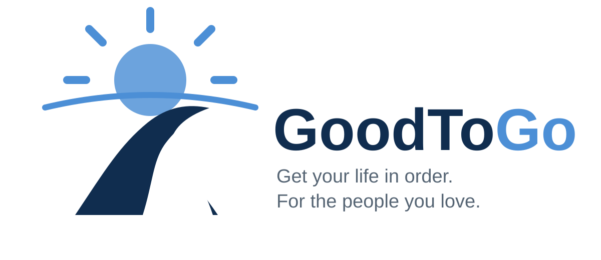

<p align="center">
  
</p>

# GoodToGo

GoodToGo is a practical act of care: a self-hosted readiness app that helps
people make the hard things easier for the people they love.

It gives households one guided place to decide, organize, locate, share, and
maintain the legal, financial, medical, digital, and practical information their
trusted people may need during incapacity or after death.

The application is an organizer and continuity tool. It does not provide legal,
financial, tax, or medical advice and does not generate legally binding documents.

## Why GoodToGo

Most households have the information survivors need, but it is scattered across
documents, accounts, devices, providers, binders, and one person's memory.
GoodToGo turns that uncertainty into a guided readiness workflow:

- Answer approachable questions across core readiness areas
- Leave with a prioritized take-home list instead of a vague sense of homework
- Keep private-session answers in the browser unless local saving is explicitly enabled
- Record credential locations and recovery paths without storing raw secrets
- Prepare for offline handoff materials that do not depend on the running app

The goal is not to make a household "done." The goal is to make the next right
steps visible, reduce avoidable searching during a crisis, and help trusted
people start from clear instructions instead of guesswork.

## Product principles

- Privacy first: private-session answers are not submitted to the server.
- Continuity over dependency: exports should remain useful without the running app.
- Organizer, not advisor: guidance points to sources and professionals; it does not replace them.
- No secret vaulting: store where credentials are kept, not passwords, recovery codes, seeds, or private keys.
- Household scoped: persistent resources must be authorized for the current household and user.

## What is included

- FastAPI application skeleton with Jinja2 templates and HTMX-friendly structure
- Responsive private-session workbook prototype with section navigation and time estimates
- Browser-local answer storage with no answer submission to the server
- Generated take-home task list with official guidance links
- Browser print/save-to-PDF views for the full workbook and take-home list
- Light, dark, and system themes with five color schemes
- PostgreSQL-ready household, subject, record, task, document, and preference models
- Versioned YAML workbook catalog
- Docker Compose deployment
- Alembic migration skeleton
- Tests for catalog validation, task generation, settings, and web routes
- Architecture, data model, content inventory, workbook, security, and roadmap docs
- `AGENTS.md` and an agent build guide for AI-assisted development

## Quick start with Docker

```bash
cp .env.example .env
docker compose up --build
```

Open <http://localhost:8080>.

## Quick start for local development

Python 3.12 or newer is recommended.

```bash
python -m venv .venv
source .venv/bin/activate
pip install -e '.[dev]'
uvicorn app.main:app --reload
```

Run the quality checks:

```bash
pytest
ruff check .
```

## Current status

This is a deliberately small, functioning foundation rather than a finished
readiness product. The private workbook, section navigation, time estimates,
theme controls, public catalog API, client-side take-home list, and browser
print views work. Authentication, persistent household CRUD, document
encryption, PDF rendering, and legal content review remain roadmap work.

Start with:

1. [Architecture](docs/architecture.md)
2. [Product requirements](docs/product-requirements.md)
3. [Roadmap](docs/roadmap.md)
4. [Agent build guide](docs/agent-build-guide.md)

## Safety boundary

Do not add fields for raw passwords, authenticator seeds, recovery codes, safe
combinations, or private cryptographic keys. Store a credential locator such as
`Bitwarden > Family Emergency collection > Router` instead.
