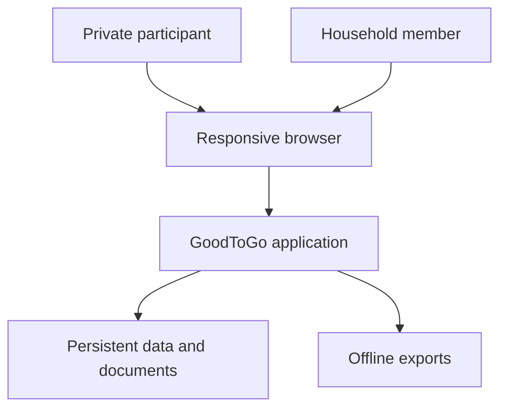
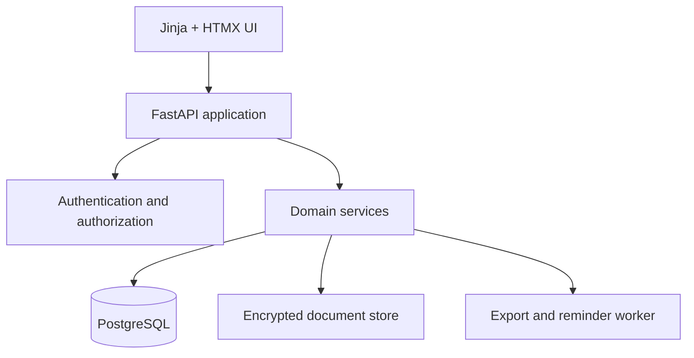

# Architecture

Status: Proposed target architecture with an MVP 1 starter implementation

## Architecture goals

- Protect an unusually sensitive collection of household information.
- Make private sessions useful without retaining participant answers.
- Support multiple households and multiple users without cross-household access.
- Keep the stack approachable for self-hosters and AI-assisted development.
- Produce offline outputs that remain useful if the application is unavailable.
- Reuse one versioned content catalog across web and print experiences.

## System context



## Operating modes

### Private session

The server provides HTML, CSS, JavaScript, and a public versioned content catalog.
Answers remain in browser memory. Optional device saving uses browser storage and must
be enabled explicitly. Follow-up task generation and printing occur in the browser.

The server may still observe ordinary HTTP metadata such as IP address, timestamp, and
requested path. Production access logs should minimize and expire this metadata.

Private-session invariants:

- No answer API
- No answer telemetry
- No server-side autosave
- No third-party scripts
- No remote fonts
- No answers in URLs
- No unencrypted download feature

### Persistent household

Authenticated users access household-scoped records through FastAPI. The application
performs relationship-aware authorization before reading or changing every object.
Sensitive payloads and documents are encrypted using per-household keys.

### Offline survival package

Exports include human-readable material and structured data. They must be usable
without the database, container stack, DNS, reverse proxy, or original administrator.

## Logical architecture



## Technology choices

| Concern | Choice | Reason |
| --- | --- | --- |
| Backend | FastAPI | Typed Python, OpenAPI, familiar development model |
| UI | Jinja2, HTMX, limited JavaScript | Responsive interactions without a separate SPA |
| Private state | Browser memory and opt-in local storage | Keeps private-session answers off the server |
| Database | PostgreSQL | Multi-user constraints, JSONB, row-level security, reliable migrations |
| ORM and migrations | SQLAlchemy 2.x and Alembic | Explicit data model and migration control |
| Record payload | Normalized security envelope plus schema-versioned JSONB | Supports diverse jurisdiction and record types without losing core relational controls |
| Document storage | Local filesystem behind an object-store interface | Simple self-hosting with a future S3-compatible option |
| PDF | Shared HTML and print CSS; server renderer later | One visual system for blank, private, and persistent exports |
| Deployment | Docker Compose behind a reverse proxy | Low operational overhead and portable self-hosting |

## Repository structure

```text
goodtogo/
├── AGENTS.md
├── README.md
├── compose.yaml
├── Dockerfile
├── pyproject.toml
├── app/
│   ├── content/             # Versioned questions and official resources
│   ├── core/                # Configuration and cross-cutting concerns
│   ├── db/                  # Engine, sessions, and base classes
│   ├── models/              # Persistent entities
│   ├── services/            # Domain logic independent from HTTP
│   ├── static/              # Local CSS and JavaScript only
│   ├── templates/           # Server-rendered pages and print layouts
│   └── main.py
├── docs/
├── migrations/
└── tests/
```

As implementation grows, add `app/api`, `app/repositories`, `app/auth`,
`app/authorization`, `app/crypto`, `app/storage`, and `app/workers` as real boundaries.
Do not create empty abstraction layers before a vertical slice requires them.

## Content architecture

Each content pack carries:

- Stable pack ID and semantic version
- Jurisdiction
- Last reviewed date
- Section and question IDs
- Help text and sensitivity
- Review cadence
- Follow-up task rules
- Official resource IDs
- Source URLs and verification dates

Question IDs are stable identifiers, not display text. Changing wording without
changing meaning can remain in the same compatible version. Changing meaning,
required evidence, or task behavior requires a version and migration review.

## Persistent record architecture

Relational columns carry authorization and lifecycle metadata:

- Household
- Creator
- Record type
- Schema version
- Ownership scope
- Visibility
- Readiness status
- Review dates

The sensitive domain payload is a versioned JSON document that can be encrypted as a
unit. This avoids dozens of brittle subtype tables while keeping tenant boundaries and
review queries relational.

## Theme architecture

CSS custom properties define semantic colors such as `--bg`, `--surface`, `--text`,
and `--accent`. Theme mode and color scheme are independent.

For authenticated users:

1. Read cached local values before CSS loads to prevent theme flash.
2. Load the authenticated preference record.
3. Reconcile the cache with the server value.
4. Save changes to the user preference endpoint and update the cache.

Private-session visitors use only local settings.

## Export architecture

Export policies select records based on audience, visibility, subject, and sensitivity.
The renderer receives an already-authorized export model. It must never query arbitrary
records while rendering.

A full survival package should eventually contain:

```text
survival-package/
├── START-HERE.pdf
├── emergency-and-incapacity.pdf
├── household-continuity.pdf
├── executor-and-survivor.pdf
├── digital-fiduciary.pdf
├── index.html
├── records.json
├── documents/
├── README.txt
└── manifest.sha256
```

The package containing complete sensitive data must be encrypted. The recovery key is
distributed separately.

## Deployment topology

- Reverse proxy terminates TLS.
- Application container runs without root, Linux capabilities, or a writable root FS.
- PostgreSQL is not published to the host network.
- Documents use a dedicated volume outside the web root.
- A later worker uses the same application image with a different command.
- Backups include database, documents, content-pack versions, encryption metadata, and
  separately protected key material.

## Key decisions still requiring ADRs

- Authentication implementation and OIDC support
- Application-managed encryption library and key lifecycle
- PDF renderer
- Storage adapter contract
- PostgreSQL row-level security policy
- Encrypted browser resume-file format
- Emergency delegate and break-glass process

