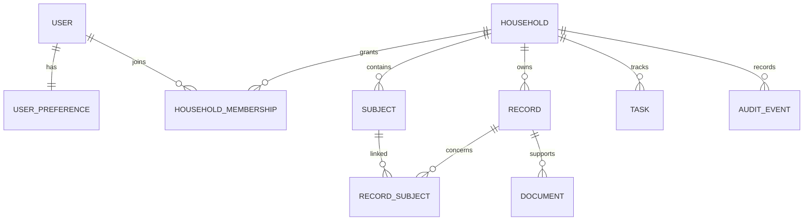

# Data Model

Status: Initial model for review before the first production migration

## Design principles

- Household tenancy is present from the first persistent schema.
- A household contains people, but not every person requires a user account.
- Ownership, visibility, responsibility, and legal authority are separate concepts.
- Flexible record payloads remain schema-versioned.
- Authorization metadata remains relational and queryable.
- The model must represent joint property and separately private information.

## Core relationships

## Entities

### User

An authenticated identity. A user may belong to more than one household.

Important fields:

- `id`
- `email`
- `display_name`
- `password_hash` or external identity link
- `is_active`

### UserPreference

One-to-one per-user settings.

- `theme_mode`: system, light, dark
- `color_scheme`: ocean, forest, ember, plum, slate
- `timezone`
- `reduced_motion`

Additional accessibility and locale preferences can be added without mixing them into
household data.

### Household

The tenant and collaboration boundary.

- `name`
- `jurisdiction`
- `content_pack_version`
- wrapped per-household data key
- encryption key version

### HouseholdMembership

Connects a user to a household. Initial roles:

- `owner`: membership and policy administration
- `contributor`: create and edit granted content
- `viewer`: view granted content
- `trusted_delegate`: limited named grants
- `professional`: time-limited named grants

Roles provide a baseline. Record access still depends on relationship, visibility,
purpose, and explicit grants.

### Subject

A person whose readiness information is represented. Examples include a spouse, minor
child, adult dependent, or household member without a login.

- Optional `linked_user_id`
- Display name
- Relationship label
- Limited identity metadata

Avoid placing high-risk identity numbers directly on the subject row.

### Record

The common envelope for legal, financial, insurance, digital, household, health,
contact, preference, and location records.

- `record_type`
- `schema_version`
- `title`
- `ownership_scope`: individual, joint, household, external
- `visibility`: private, household, named_grants, incapacity, executor, digital_fiduciary
- encrypted JSON payload
- readiness state
- last verification and next review

### RecordSubject

Connects one record to one or more subjects and describes the relationship:

- owner
- joint_owner
- beneficiary
- dependent
- insured
- responsible_person

The relationship list will be constrained after the content inventory is finalized.

### Document

Metadata for an encrypted object associated with a record.

- Random storage key
- Original display filename
- Server-detected media type
- Size and SHA-256 digest
- Encryption nonce and key version
- Scan state
- Uploaded-by user and timestamps

The storage key must never use a user-controlled filename.

### Task

A durable persistent follow-up item generated from workbook responses or created by a
user.

- Source question
- Subject
- Assignee
- Priority and status
- Due and completion timestamps
- Guidance resource references

Private-session tasks are generated in the browser and are not written to this table.

### AccessGrant

Planned entity not yet represented in the code skeleton. It should support:

- Grantor and grantee
- Household, subject, record, or export scope
- Allowed actions
- Purpose
- Start and expiration
- Revocation
- Optional emergency-release policy

### AuditEvent

Append-only security event metadata. It should identify an action without copying the
sensitive record value into logs.

Events include:

- Sign-in and MFA changes
- Membership and grant changes
- Record create, view, update, and delete
- Document upload and download
- Export generation and download
- Emergency-access request, approval, denial, and expiration
- Encryption-key rotation

## Deletion and retention

- Household deletion requires a deliberate, recoverable workflow.
- Account deletion must resolve owned households and outstanding grants.
- Revoking membership immediately removes access but does not erase audit evidence.
- Audit retention should be documented and bounded.
- Document deletion must remove the object and record a tombstone event.
- Backup retention means deletion from live storage cannot promise immediate removal
  from every backup. The product must disclose this clearly.

## Database enforcement

Application authorization is mandatory. PostgreSQL row-level security should later add
defense in depth using a transaction-scoped current user and household context.

Constraints should enforce:

- Unique user email after normalization
- Unique user membership per household
- Valid theme and color values
- Valid readiness, ownership, visibility, and task states
- Household consistency among record, subject, document, task, and grant references
- Immutable audit-event content

