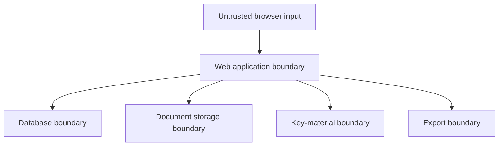

# Security and Threat Model

Status: Initial design threat model  
Classification: Contains security architecture, not user data

## Security objective

Prevent unauthorized disclosure or modification of a concentrated collection of
identity, medical, financial, legal, household-security, and digital-account metadata
while keeping authorized recovery practical.

Availability matters, but offline exports mean the application is not the only recovery
path.

## Trust boundaries

## Protected assets

- Personal and family relationships
- Medical and incapacity information
- Account and asset inventory
- Document contents
- Credential locations and recovery topology
- Home-network and security-system information
- Access grants and emergency delegate relationships
- Encryption keys
- Exports and backups
- Audit history

## Threat actors

- Unauthenticated internet attacker
- Authenticated member attempting cross-household access
- Household member exceeding granted visibility
- Compromised browser or stolen device
- Malicious uploaded document
- Compromised application container
- Infrastructure administrator
- Backup thief
- Recipient who receives the wrong export
- Attacker abusing emergency-access workflows

## Key threat scenarios and controls

| Threat | Initial controls | Later controls |
| --- | --- | --- |
| Cross-household object access | Household IDs, centralized authorization, UUIDs, tests | PostgreSQL RLS and authorization regression suite |
| Account takeover | Secure sessions, rate limits, strong password hashing | Passkeys, TOTP, OIDC, recovery codes |
| Private-session collection | No answer endpoint, no analytics, local processing | Automated network-boundary browser test |
| Database theft | Minimize data, encrypted payloads | Per-household envelope encryption and rotation |
| Backup theft | Encrypted backups | Separate backup keys and restore drills |
| Malicious upload | Allowlist, signature and size validation, non-public storage | Malware scan, quarantine, safe preview pipeline |
| Export disclosure | Explicit profile and warnings | Step-up authentication, expiry, watermark, audit |
| Emergency-access fraud | No automatic access in early MVP | Notice, delay, approval, revocation, audit, recovery policy |
| Host compromise | Non-root container, read-only FS, no capabilities | Key separation and hardened deployment profile |
| Sensitive logs | Structured allowlist logging | Automated log-content tests and retention policy |

## Private-session privacy

The current implementation requests the public content catalog but does not submit
answers. Device storage is opt-in. Theme preferences are not treated as sensitive and
are stored locally.

Required verification before release:

- Browser integration test fails if answer values appear in any request.
- No third-party scripts, images, fonts, or analytics.
- No answer values in URLs, referrers, errors, or console logs.
- Clear-session removes private answer storage.
- Production reverse-proxy logs do not include query strings or request bodies.

An encrypted resume-file feature should use a documented, interoperable format with a
memory-hard password KDF and authenticated encryption. Do not invent cryptography.

## Persistent encryption

Target envelope model:

1. Generate a random data-encryption key for each household.
2. Encrypt sensitive record payloads and files with an authenticated encryption mode.
3. Wrap the household key with a versioned instance key-encryption key.
4. Store the wrapped household key with the household, not the wrapping key.
5. Support rotation and backup restoration before enabling production data.

Server-side application encryption does not create a zero-knowledge service. A person
who controls the running app and its key material may be technically capable of
decrypting persistent content. This limitation must be documented in the UI and admin
guide.

Relevant guidance:

- [OWASP Cryptographic Storage Cheat Sheet](https://cheatsheetseries.owasp.org/cheatsheets/Cryptographic_Storage_Cheat_Sheet.html)
- [OWASP Password Storage Cheat Sheet](https://cheatsheetseries.owasp.org/cheatsheets/Password_Storage_Cheat_Sheet.html)
- [OWASP Key Management Cheat Sheet](https://cheatsheetseries.owasp.org/cheatsheets/Key_Management_Cheat_Sheet.html)

## Authentication and sessions

Requirements:

- Argon2id password hashing when local passwords are used
- MFA support before general internet exposure
- Secure, HTTP-only, same-site session cookies
- CSRF tokens for state-changing browser requests
- Session rotation at authentication and privilege changes
- Step-up authentication before full export or key-management actions
- Rate limiting without logging submitted credentials
- Deliberate account-recovery design that does not bypass household encryption

## Authorization

- Deny by default.
- Check permission for every object and action.
- Scope collection queries before results are loaded.
- Do not fetch then filter unauthorized objects in application memory.
- Test horizontal and vertical privilege escalation.
- Separate instance administration from household membership.
- Treat export generation and download as separate authorized actions.

Reference: [OWASP Authorization Cheat Sheet](https://cheatsheetseries.owasp.org/cheatsheets/Authorization_Cheat_Sheet.html)

## Document handling

- Allow only required formats.
- Validate extension, detected media type, and file signature.
- Generate storage names.
- Enforce per-file and per-household limits.
- Store outside the web root.
- Serve only through an authorized download handler.
- Use attachment disposition for risky types.
- Never send private documents to public malware-analysis services.
- Quarantine before optional local scanning.

Reference: [OWASP File Upload Cheat Sheet](https://cheatsheetseries.owasp.org/cheatsheets/File_Upload_Cheat_Sheet.html)

## Export and print safety

- Preview the audience and included sections.
- Default to redacted identifiers.
- Exclude credentials and recovery secrets by design.
- Mark sensitivity and generation date on every page.
- Require reauthentication for full private archives.
- Do not retain temporary plaintext exports beyond the request.
- Audit generation separately from download.
- Warn users that printer queues and downloaded PDFs may retain copies.

## Emergency access

Do not ship automated release until the abuse and recovery design is independently
reviewed. A missed check-in alone is not proof of incapacity or death.

A future workflow may include:

- Named delegate requests access
- Immediate notices through multiple channels
- Owner or co-owner approval path
- Configurable waiting period
- Rejection and revocation
- Limited audience-specific export rather than full account takeover
- Immutable audit trail
- Manual legal process when policy conditions cannot be satisfied

## Security release gates

Before persistent production use:

- Threat model reviewed
- Authentication and authorization tests pass
- Cross-household isolation tested
- Cryptographic design reviewed
- Key rotation and restore tested
- Upload controls tested
- Export redaction tested
- No sensitive logging confirmed
- Dependency and container scans pass
- Backup restore completed from documented steps

